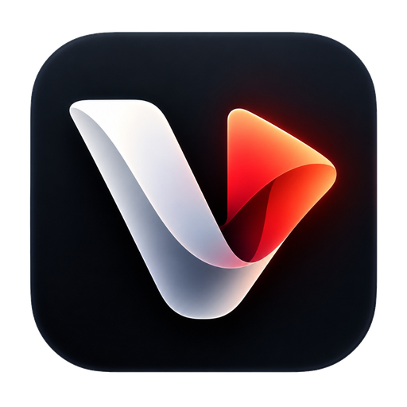

# ⚡ VidAmp Player: The Ultimate Standalone PC Video Player

<div align="center">
  
  <h2>VidAmp Player — Standalone PC Video Player</h2>
  <p><strong>Powered by Electron + Vite + HTML5 Web Audio & Direct3D11 Acceleration for Windows</strong></p>
  <p><em>Combining VidAmp's precision gesture controls with the legendary power features of VLC Media Player and MPC-HC.</em></p>

  <p>
    <a href="https://github.com/Chandan-14r/vidamp-desktop-player/releases/latest"></a>
    <a href="https://chandanrs.itch.io/vidamp-player"></a>
    
    <a href="LICENSE"></a>
  </p>

  <p>
    <em>Precision exponential gestures • 10-Band studio audio EQ • Universal dynamic ambient glow • OpenSubtitles auto-fetch • Dual-audio track switcher • Always-on-top Mini PiP • 1-Click GIF / clip exporter • D3D11 HDR tone mapping</em>
  </p>
</div>

---

## 📦 Downloads & Installation

No complex installers or dependencies required. Choose your preferred download source:

| Platform / Source | Link | Format | Size |
|:---|:---|:---|:---|
| 🐙 **GitHub Releases** | [**Download VidAmp-Player-v1.0.0-win64.zip**](https://github.com/Chandan-14r/vidamp-desktop-player/releases/tag/v1.0.0) | Portable `.zip` | ~163 MB |
| 🎮 **Itch.io Store** | [**Visit VidAmp on Itch.io**](https://chandanrs.itch.io/vidamp-player) | Direct Download | ~163 MB |

> [!TIP]
> **Quick Start**: Extract the `.zip` archive to any directory on your PC and double-click **`VidAmp Player.exe`**.  
> *(If Windows SmartScreen appears on first launch, click **More info** $\rightarrow$ **Run anyway**).*

---

## 🌟 Architecture & Capabilities

VidAmp Player is built from the ground up as a standalone, modern desktop video powerhouse. It features a strict **0% video overlap** docking architecture where the Enhancer toolbar and scrub timeline sit directly below the video viewport, eliminating UI clutter.

```
vidamp-desktop-player/
├── electron/
│   ├── main.js              # Electron main process (native dialogs, window scaling, frameless Mica/acrylic)
│   ├── preload.js           # Secure IPC bridge (scaleWindow, saveScreenshot, saveClip, openDialogs)
│   └── icons/               # Multi-resolution application icons (16, 32, 48, 64, 128, 256, 512, .ico)
├── src/
│   ├── styles/
│   │   └── main.css         # Obsidian glassmorphic theme, 0% overlap dock, and neon accents
│   ├── modules/
│   │   ├── audio.js         # 200% boost + limiter, bass boost +7dB, vocal peak +6dB, 10-band EQ, audio delay sync (J/K)
│   │   ├── ambient.js       # Universal dynamic bias lighting canvas (32x18 GPU blur sampler)
│   │   ├── speed.js         # Snap-to-grid ([ and ]), exponential gestures, 1-click popover, hold-to-boost
│   │   ├── subtitles.js     # OpenSubtitles REST auto-fetch, SRT/VTT/ASS parser, VLC-style G/H delay sync
│   │   ├── videoFilters.js  # Color filters (HDR, OLED, Cinema), aspect ratio switcher, rotation & mirror flip
│   │   ├── hlsPlayer.js     # HLS (.m3u8) live streams and direct URL network streaming
│   │   ├── tools.js         # FFmpeg GIF / MP4 exporter, A-B loop repeater, screenshot saver, bookmarks
│   │   ├── playlist.js      # Track queue, shuffle, repeat, M3U playlist export, recent history memory
│   │   ├── mediaInfo.js     # MPC-HC style on-screen stream HUD stats (FPS, codec, resolution, dropped frames)
│   │   ├── shortcuts.js     # Master VLC, MPC-HC, and VidAmp keyboard & gesture dispatcher
│   │   └── ui.js            # Docking manager, idle autohide, popovers, and drawer controls
│   └── main.js              # Application coordinator
├── index.html               # Main HTML5 viewport & docked layout
├── package.json             # Build configuration & dependencies (Electron, Vite, hls.js)
├── vite.config.js           # Vite build pipeline
└── start.bat                # One-click Windows launch batch
```

---

## 🚀 Key Feature Matrix

### 1. 🎬 Media Engine & Playback Controls
* **Format Support**: Plays `.mp4`, `.mkv`, `.webm`, `.mov`, `.avi`, `.ts`, `.flv`, `.wmv`, `.m4v`, `.mp3`, `.wav`, `.aac`, `.flac`, `.ogg` via drag-and-drop or native Windows File Picker.
* **Network Streams**: Built-in support for live HLS streams (`.m3u8`) and direct HTTP/HTTPS video feeds via `hls.js`.
* **Playlist Queue**: Track management, shuffle mode, repeat modes (`off`, `all`, `one`), reordering, and **M3U playlist export**.
* **Smooth Seekbar**: Interactive scrub bar with buffered range indicators, timestamp hover preview, and remaining time toggle (click time to toggle elapsed `MM:SS` vs remaining `-MM:SS`).
* **Playback Jumps (VLC & MPC-HC)**:
  * Small jump: `←` / `→` (±5 seconds)
  * Medium jump: `Alt + ←` / `Alt + →` (±10 seconds)
  * Large jump: `Ctrl + ←` / `Ctrl + →` (±60 seconds)
  * Exact jump: `Ctrl + J` or `Ctrl + T` to jump to specific `HH:MM:SS`.
* **Frame-by-Frame Stepping**: Precision frame navigation with `.` (forward 1 frame ~0.033s) and `,` (backward 1 frame).
* **Guaranteed Spacebar Play/Pause**: Single-toggle action with active element blur protection to prevent button reactivations.
* **Resume Playback & Auto-Next Episode**: Remembers your last watched timestamp on media files and prompts a smart countdown during end credits.

---

### 2. ⚡ Precision Gestures & Exponential Speed Controller
* **Exponential Seeking Gesture**: Dragging horizontally accelerates exponentially across the timeline for lightning-fast long-video navigation.
* **Calibrated Volume Gesture (0–20 Scale)**: Natural stepped volume control with responsive visual feedback.
* **Hold Spacebar for 2× Speed**: Press and hold `Spacebar` (or long-click video) to temporarily boost playback to **2.0×**; releasing immediately restores your previous rate.
* **Snap-to-Grid Stepping (`[` and `]`)**:
  * Press `[`: snaps down on a `0.25×` grid (e.g. `1.4×` $\rightarrow$ `1.25×` $\rightarrow$ `1.0×` $\rightarrow$ `0.75×`).
  * Press `]`: snaps up on a `0.25×` grid (e.g. `1.4×` $\rightarrow$ `1.5×` $\rightarrow$ `1.75×` $\rightarrow$ `2.0×`).
* **1-Click Speed Popover**: Direct 1-click access to presets: `0.25×`, `0.5×`, `0.75×`, `1×`, `1.25×`, `1.4×`, `1.5×`, `1.75×`, `2×`, `2.5×`, `3×`, `4×`.
* **Instant Reset**: Press `R` or right-click the speed pill to reset immediately to `1.0×`.

---

### 3. 🔊 Studio Audio Suite & Multi-Track Audio Switcher
* **Dual-Audio & Multi-Track Switcher**: Detects and switches between alternate language tracks, commentaries, and surround sound channels (`B` shortcut).
* **200% Safe Volume Boost with Limiter**: Web Audio API `DynamicsCompressorNode` (`threshold: -6dB`, `ratio: 12`) prevents clipping and harsh digital distortion even at maximum volume boost.
* **Studio Bass Boost (+7dB Low-Shelf)**: Tuned at `140Hz` for deep, cinematic bass.
* **Vocal Clarity (+6dB Peaking)**: Peaking filter at `2500Hz` (`Q = 1.0`) specifically tuned for podcast, dialogue, and tutorial clarity.
* **Audio Delay Sync (VLC `J` and `K` keys)**: Shift audio timing by ±50ms per press (range: `-5000ms` to `+5000ms`) to permanently fix out-of-sync audio tracks!
* **10-Band Graphic Equalizer**: Studio parametric bands (31Hz, 62Hz, 125Hz, 250Hz, 500Hz, 1kHz, 2kHz, 4kHz, 8kHz, 16kHz) with presets (Flat, Bass Heavy, Vocal Boost, Rock, Pop, Classical, Movie Dialogue, Club, Night Cinema).
* **Live Spectrum Visualizer**: Animated 64-bar frequency analyzer canvas in the Pro Audio drawer.

---

### 4. 💬 Subtitles & Auto-Fetch Engine
* **Auto-Fetch Online Subtitles**: Search and download subtitles directly from OpenSubtitles with auto-decompression and auto-naming.
* **Format Support**: Loads external `.srt`, `.vtt`, `.ass`, `.sub` files via file picker or drag-and-drop.
* **Subtitle Delay Sync (VLC `G` and `H` keys)**: Adjust subtitle timing by ±50ms increments to fix delayed subtitles.
* **Custom Styling**: Clean, high-legibility subtitle overlay with customizable font size, outline, and contrast background.
* **Toggle Subtitles**: Toggle subtitle visibility with `V`.

---

### 5. 🌌 Visual Enhancements, GPU Diagnostics & HDR Tone Mapping
* **Dynamic Ambient Glow (Dynamic Bias Lighting)**: GPU-accelerated `32×18` canvas sampler projecting a glowing halo (`blur(65px) saturate(2.2) brightness(1.2)`) behind the player frame with $<0.2\text{ms}$ GPU draw time.
* **Hardware Acceleration Diagnostics**: Zero-copy Chromium GPU rasterization with live FPS, frame time, and Direct3D11 diagnostics modal.
* **HDR Tone-Mapping Curves**: Instant cycle between BT.2020 HDR Passthrough, Cinema Contrast, and OLED Ultra-Black modes.
* **Cinema Mode**: Dims the entire environment with a dark veil, spotlighting only the active video.
* **Aspect Ratio Switcher**: Cycle between 16:9 Standard Fit, 21:9 Ultrawide Crop, Stretch-to-Fill, and 4:3 Classic TV Fit.
* **Video Rotation & Mirror Flip**: Rotate 90°, 180°, 270°, and Horizontal Mirror Flip (essential for dancing, sports, and tutorials).

---

### 6. ⏱️ Creator Tools, GIF Exporter & Mini PiP
* **1-Click GIF / MP4 Clip Exporter**: High-resolution palette-generated GIF and MP4 export from A-B loops with customizable resolution (480p, 720p, Source).
* **Always-On-Top Mini PiP Controller (`Shift + P`)**: Borderless corner floating window with playback controls.
* **A-B Loop Repeater**: Mark Loop Point A and Point B on the timeline to repeat any scene or segment indefinitely.
* **Frame Capture / Screenshot**: Saves native full-resolution video frame screenshots directly to your Windows Pictures directory (`VidAmp_Clip_14s.png`).
* **Timestamp Bookmarks**: Save moments with `Shift + B`; popover jump list lets you seek back to any bookmark with 1 click.
* **Sleep Timer**: Auto-pause with gentle 3-second volume fade (15m, 30m, 45m, 60m, or Stop at Video End). Shortcut: `Shift + S`.

---

## ⌨️ Master Keyboard & Gesture Shortcuts

| Shortcut | Action | Description |
|:---|:---|:---|
| `Space` | **Play / Pause** | Single-toggle action without repeat, blurs active element |
| `Hold Space` / `Long-Click` | **Hold-to-2× Boost** | Temporary 2.0× speed while holding, restores rate on release |
| `[` | **Snap Speed Down** | Snaps down on 0.25 grid (e.g. 1.4× $\rightarrow$ 1.25× $\rightarrow$ 1.0×) |
| `]` | **Snap Speed Up** | Snaps up on 0.25 grid (e.g. 1.4× $\rightarrow$ 1.5× $\rightarrow$ 1.75×) |
| `R` | **Reset Speed** | Instantly restores playback rate to `1.0×` |
| `B` | **Audio Track Switcher** | Cycle through available audio language/surround tracks |
| `Shift + P` | **Mini PiP Controller** | Toggle always-on-top borderless corner mini window |
| `.` or `>` | **Frame Forward** | Steps forward 1 frame (~0.033s) |
| `,` or `<` | **Frame Backward** | Steps backward 1 frame (~0.033s) |
| `←` / `→` | **Jump ±5s** | Small jump (VLC standard) |
| `Alt + ←` / `→` | **Jump ±10s** | Medium jump |
| `Ctrl + ←` / `→` | **Jump ±60s** | Large jump |
| `Ctrl + J` / `Ctrl + T` | **Jump to Time** | Prompt dialog to jump to exact timestamp |
| `J` / `K` | **Audio Delay Sync** | Adjust audio offset by ±50ms (VLC) |
| `G` / `H` | **Subtitle Delay Sync** | Adjust subtitle offset by ±50ms (VLC) |
| `V` | **Toggle Subtitles** | Show / hide subtitle tracks |
| `I` | **Stream HUD Stats** | Toggle MPC-HC resolution, FPS, and dropped frames overlay |
| `Alt + 1 / 2 / 3` | **Scale Window** | 50% / 100% / 200% window scaling (MPC-HC) |
| `Alt + B` | **Pro Tools Drawer** | Toggle Equalizer, Multi-Track, and Filter drawers |
| `Shift + A` | **Ambient Glow** | Toggle universal dynamic bias lighting |
| `Shift + B` | **Bookmark Moment** | Save current timestamp to jump list |
| `Shift + S` | **Sleep Timer** | Cycle sleep timer with volume fade |
| `F` | **Fullscreen** | Toggle borderless fullscreen |
| `P` | **Picture-in-Picture** | Native browser Picture-in-Picture |
| `M` | **Mute / Unmute** | Toggle audio mute |
| `?` | **Cheat Sheet** | Open shortcut help modal |

---

## 🛠️ Development & Building from Source

```bash
# Clone the repository
git clone https://github.com/Chandan-14r/vidamp-desktop-player.git
cd vidamp-desktop-player

# Install dependencies
npm install

# Run development mode
npm run dev

# Launch desktop app with Electron
npm start

# Build web release
npm run build

# Package standalone Windows x64 binary
npm run package
```

---

## 📄 License

This project is licensed under the [MIT License](LICENSE) © 2026 Chandan.
